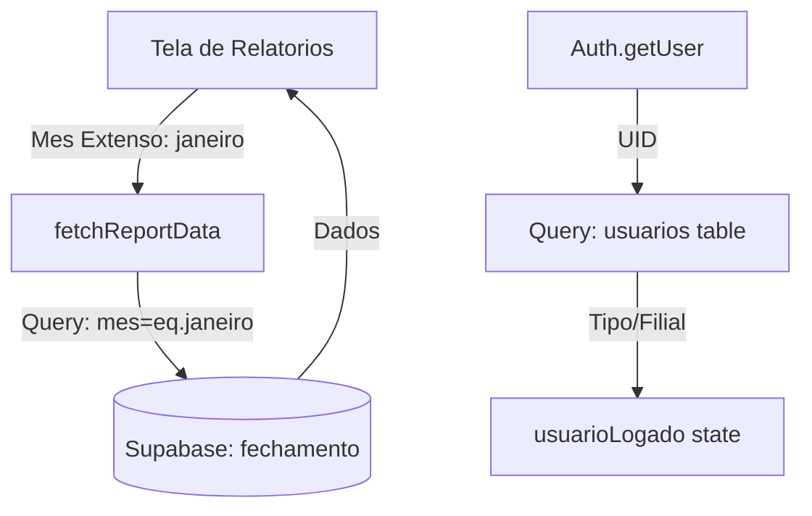

O problema de 'Nenhum dado encontrado' na tela de relatórios ocorre devido a uma divergência entre o formato do mês armazenado no banco de dados (ex: 'janeiro') e o formato esperado pelo filtro (ex: '01'). Além disso, o erro 400 no console indica uma falha na query de busca do usuário logado na tabela `colaboradores`.

### 1. Correção do Erro 400 (Busca de Usuário)

O erro ocorre em `[src/app/(dashboard)/relatorios/page.tsx](src/app/(dashboard)/relatorios/page.tsx)` ao tentar buscar dados do usuário na tabela `colaboradores` usando `user_id`. A estrutura atual da tabela `colaboradores` não possui a coluna `user_id`, apenas `id` (UUID). Os dados de tipo de usuário e filial estão na tabela `usuarios`.

### 2. Correção da Sincronização de Dados (Filtro de Mês)

A função `fetchReportData` em `[src/lib/relatorios.ts](src/lib/relatorios.ts)` converte o nome do mês para número (ex: 'janeiro' -> '01'), mas a tabela `fechamento` armazena o nome do mês por extenso em letras minúsculas.

### 3. Melhoria na Busca de Dados

Ajustar a lógica de busca para garantir que os dados sejam carregados corretamente independentemente do papel do usuário (admin vê tudo, colaborador vê apenas sua filial).

### Mermaid Diagram: Fluxo de Dados Corrigido

