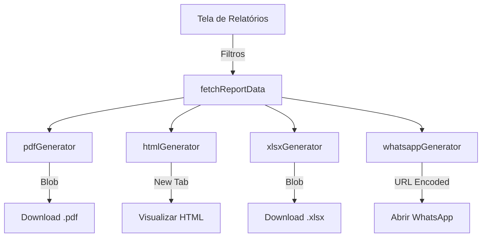

O plano aborda três frentes principais: estética (background), usabilidade (toggle de filtros) e funcionalidade (geração de relatórios avançados).

### Ajuste 1: Background na Tela de Login/Cadastro

- Modificar `[src/app/login/page.tsx](src/app/login/page.tsx)` e `[src/app/cadastro/page.tsx](src/app/cadastro/page.tsx)` para incluir a imagem `public/backgroundpickprod2.png` com overlay de legibilidade e blur.
- Garantir responsividade e contraste adequado para acessibilidade.

### Ajuste 2: Toggle de Filtros Reutilizável

- Criar o componente `[src/components/FilterToggle.tsx](src/components/FilterToggle.tsx)` que encapsula a lógica de mostrar/ocultar filtros e exibe o contador de filtros ativos.
- Implementar o componente nas telas:
  - `[src/app/(dashboard)/produtividade/page.tsx](src/app/(dashboard)/produtividade/page.tsx)`
  - `[src/app/(dashboard)/resultado/page.tsx](src/app/(dashboard)/resultado/page.tsx)`
  - `[src/app/(dashboard)/descontos/page.tsx](src/app/(dashboard)/descontos/page.tsx)`
  - `[src/app/(dashboard)/relatorios/page.tsx](src/app/(dashboard)/relatorios/page.tsx)`

### Ajuste 3: Sistema Completo de Relatórios

- **PDF:** Criar `[src/lib/relatorios/pdfGenerator.ts](src/lib/relatorios/pdfGenerator.ts)` usando `jspdf` e `jspdf-autotable`. O relatório terá múltiplas tabelas (Fechamento, Resultado, Descontos, Produtividade, Geral) baseadas no modelo `dados/relatoriomodelo.pdf`.
- **HTML:** Criar `[src/lib/relatorios/htmlGenerator.ts](src/lib/relatorios/htmlGenerator.ts)` seguindo o código de referência `dados/Relatoriomodelocode.jsx`. Incluirá cabeçalho com logo, cards de KPI, gráficos (usando Chart.js ou similar para versão estática/impressão) e tabelas detalhadas.
- **XLSX:** Atualizar `[src/lib/relatorios.ts](src/lib/relatorios.ts)` ou criar `[src/lib/relatorios/xlsxGenerator.ts](src/lib/relatorios/xlsxGenerator.ts)` usando `exceljs`. Unificar colunas das tabelas `dados_produtividade`, `fechamento` e `descontos`. Formatar com cabeçalho verde (#228B22), texto branco, negrito, Calibri 12, e dados em Calibri 10 com grade e filtros.
- **WhatsApp:** Criar `[src/lib/relatorios/whatsappGenerator.ts](src/lib/relatorios/whatsappGenerator.ts)` para gerar mensagens formatadas com emojis contendo o resumo do resultado por colaborador.
- **Integração:** Atualizar `[src/app/(dashboard)/relatorios/page.tsx](src/app/(dashboard)/relatorios/page.tsx)` para conectar todos os geradores aos botões da interface.

### Mermaid Diagram: Fluxo de Geração de Relatórios

